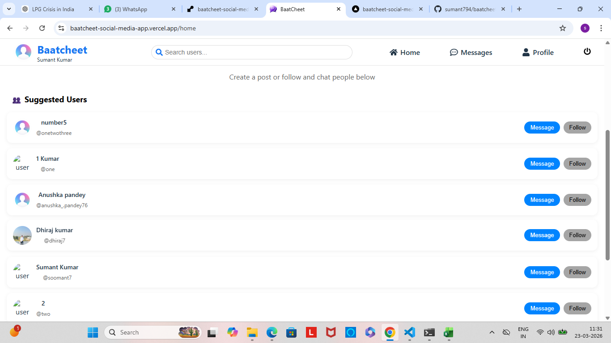
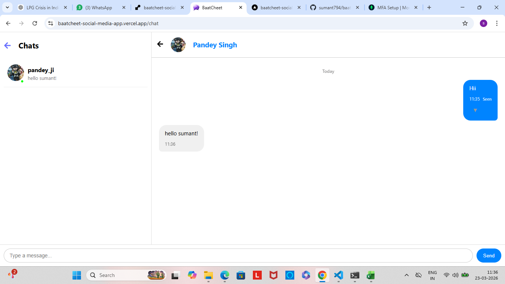

# 💬 BaatCheet - Real-Time Social Media App

BaatCheet is a full-stack social media and real-time chat application built using the MERN stack. It allows users to connect, chat instantly, and interact with others seamlessly.

---

## 🚀 Live Demo

🌐 https://baatcheet-social-media-app.vercel.app

---

## ✨ Features

### 🔐 Authentication
- User signup & login
- JWT-based authentication
- Secure cookies handling

### 💬 Real-Time Chat
- One-to-one messaging
- Instant message delivery using Socket.IO
- Typing indicator
- Message seen status

### 🟢 Online Status
- Real-time online/offline users
- Active user tracking

### 📸 Social Features
- Create posts with images
- Like & comment system
- Image upload via Cloudinary

### ⚡ Performance
- Optimized API calls
- Rate limiting (security)
- Smooth UI experience

---

## 🛠️ Tech Stack

### Frontend
- React (Vite)
- Axios
- Context API

### Backend
- Node.js
- Express.js

### Database
- MongoDB (Mongoose)

### Realtime
- Socket.IO

### Deployment
- Frontend: Vercel
- Backend: Render

---

## ⚙️ Installation & Setup

### 1️⃣ Clone the repository

```bash
git clone https://github.com/sumant794/baatcheet-social-media-app.git
cd baatcheet-social-media-app

2️⃣ Install dependencies

cd baatcheet-frontend
npm install

cd ../baatcheet-backend
npm install

3️⃣ Setup environment variables

Create .env file in backend:
PORT=5000
MONGODB_URI=your_mongodb_uri
ACCESS_TOKEN_SECRET=your_secret
REFRESH_TOKEN_SECRET=your_secret
CLOUDINARY_CLOUD_NAME=your_name
CLOUDINARY_API_KEY=your_key
CLOUDINARY_API_SECRET=your_secret
CORS_ORIGIN=http://localhost:5173

```
---

```bash
4️⃣ Run the app

Backend:
npm run dev

Frontend:
npm run dev

```
---

🔌 Socket Events
user_online
join_chat
typing
stop_typing
messages_seen

🧠 Key Learnings
Real-time communication using WebSockets
Handling production deployment issues (CORS, HTTPS, Render sleep)
State management in React
Secure authentication system

## Screenshots
 

⚠️ Known Issues
Backend may take time to respond initially (Render free tier sleep mode)
Mixed content warnings if image URLs are not HTTPS

